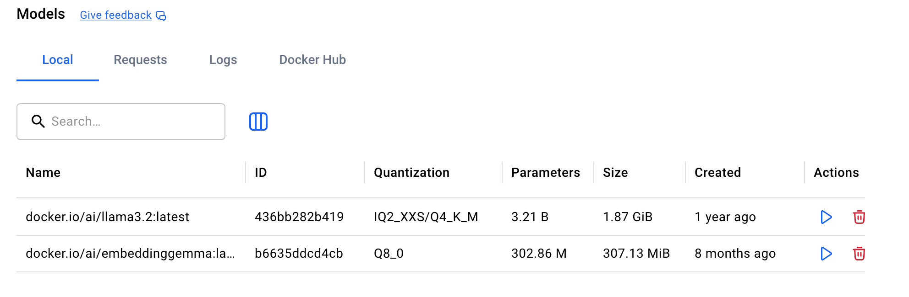
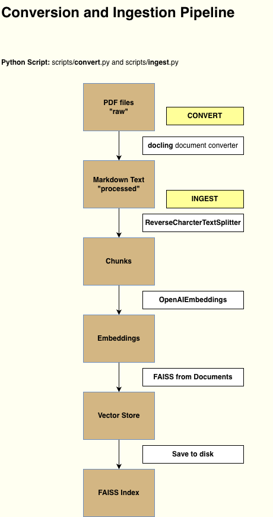
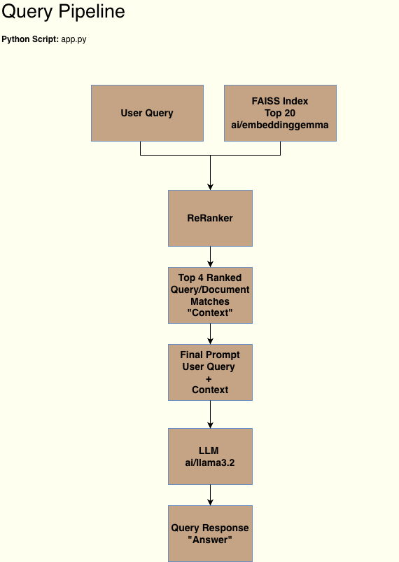

# Local RAG App (FAISS + LangChain + Docker Model Runner)

This project is a lightweight Retrieval-Augmented Generation (RAG) system that is useful for
learning how RAG works.  Claude.AI helped me with coding and documenting the app.py script.  The models used can be run locally using Docker Model Runner.  At least 16 GB of memory is needed to run the models and the application script and 32 GB is the recommended amount of memory.

It runs entirely locally using:

- FAISS for vector search
- LangChain for chaining
- Docker Model Runner (DMR) for both embeddings and LLM inference models
- Four local HR policy documents in PDF format as the knowledge base

The app loads a FAISS index, retrieves relevant chunks, and answers user questions 
using a local LLM.  The FAISS index cannot be used with version of Python greater than 3.13.

The documents have been converted from PDF to Markdown text and loaded into a FAISS index.  If you want to change the documents or try out the conversion and ingestion scripts, you'll find the ata in the documents in the /data directory and the scripts for conversion and extraction in the /scripts directory.

## Requirements
At the time of the creation of this project, the use of Python versions > 3.13 with LangChain can lead to significant installaton and ruttime issues due to lagging support in 3rd party provider integrations and dependencies.

- Python 3.13
- Python packages
    - langchain-core
    - langchain-community
    - langchain-openai
    - faiss-cpu
    - sentence_transformers
    - dotenv
- Docker Model Runner with:
    - ai/embeddinggemma
    - ai/llama3.2 (or your chosen LLM)

## Docker Model Runner
Two models are used to used for this RAG projects: one as the LLM to which prompts are submitted, and one to hold embeddings. The embeddings are stored in FAISS index which is like a local database.  

To learn more about using Docker Model Runner to host AI models on your local machine, see this <a href="https://medium.com/@code-literacy/docker-model-runner-wow-5397090b3251" target="_blank">Docker Model Runner Blog Post</a>.

The RAG project requires two models be pulled:
1. `ai/llama3.2` serves as LLM Inference provider so that you can ask AI questions.
2. `ai/embeddinggemma` provides a method to create text embeddings. These embeddings are numerical representations. Part of the process of setting up RAG is adding content and making that content retrievable py the Inference model.

If you're running locally you want to choose model that don't requires a lot of parameters in order to save manage resources. Both of the models suggested above will be available and efficent.

### Reranking
Reranking is part of the RAG Retrieval Pipeline. It compares text from the prompt to retrieved data.  thr cross-encoder reads the query text and the data together and outputs a rank score. The top scores will provide the context for the LLM.

Importing the `sentence_transformer` packages provides the `cross-encoder/ms-marco-MiniLM-L-6-v2`.  This mini model is downloaded and used for ranking FAISS index content captured in the embeddings model.  The ranked FAISS index data is sorted and the top 4 chunks are passed to the `llama3.2` LLM as context.  The `cross-encoder/ms-marco-MiniLM-L-6-v2` will be downloaded and cached on your local drive under your user directory the first time you run the code.

## Logging
I've added logging adjustments to prevent warnings that aren't relevant to running the code. You should still get logging errors when there are errors, but not for warnings.  See the documentation in the code for this.

## Install and Run

1. Install Python version 3.13.
2. Create a virtual environment: `python3.13 -m venv .venv`.
3. Activate the virtual environment: `source .venv/bin/activate` (MAC).    
or `.venv\Scripts\activate` (WINDOWS COMMAND PROMPT).  
4. Install packages: `pip install -r requirements.txt`. 
5. Set up Docker to load and run the two models: ai/llama3.2 and ai/embeddinggemma 
6. Run the app: `python app.py`. 
7. (Optional) If you're using this to learn how the RAG flow behaves, you can run the `app_debug.py` script to get information back at each step.  

Depending on the memory in your local hardware, the app may be slow to respond.

## Data Pipelines

1. Raw data (.pdf's) are located in ./data/raw
2. Processed data (.md) is generated using ./scripts/convert.py
3. Data is loaded into embeddings using scripts/ingest.py which creates ./faiss_index
4. Prompts are created and serviced in ./app.py

### Conversion and Ingestion Pipeline

### Query Pipeline

## Example: Human Resources Standard Operating Procedures

The sample content that will be accessible in this RAG will help to answer questions that users have about Human Resources.  Building on this could create a tool used by any employee to lookup information from Human Resources.

